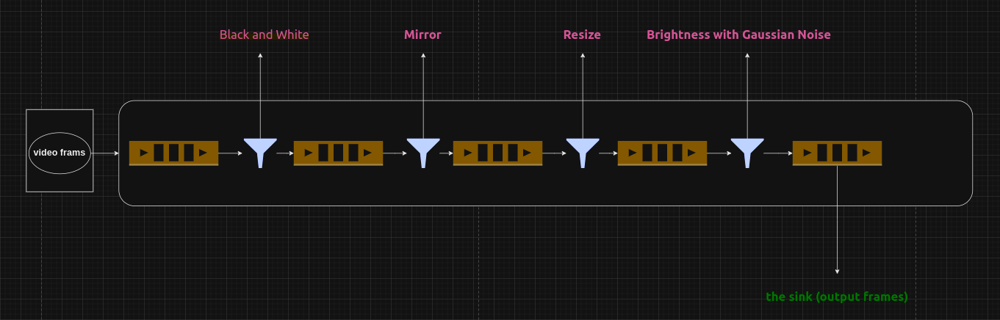

# Video Processing Pipeline with Filters


This project demonstrates a video processing pipeline that captures video frames, applies a series of filters, and displays the original and processed frames. The pipeline works with both webcam and video file inputs, using the **Pipes and Filters** pattern.

## Features

- **Video Capture**: Capture video from a webcam or video file.
- **Frame Filters**: Apply various filters to video frames such as:
  - `Black and White Filter`
  - `Mirror Filter`
  - `Resize Filter`
  - `Brightness Adjustment with Gaussian Noise`
- **Real-time Display**: Show both original and filtered video frames in real-time.
- **Threaded Pipeline**: Each component (capture, filters, display) runs in its own thread, allowing concurrent processingm , so each filter is consider as independent process (`multiple frames is processed by different filters at the same time`) .
- **Timestamp Tracking**: Syncing the processed video with the original frames, especially when some filters might take more time than others.


## How It Works

1. **Capture**: Frames are captured from a video file or webcam.
2. **Filter Chain**: Frames are passed through a series of filters:
   - **Black and White**: Converts the frame to grayscale.
   - **Mirror**: Mirrors the frame horizontally.
   - **Resize**: Resizes the frame.
   - **Brightness with Gaussian Noise**: Adds brightness and noise to the frame.
3. **Display**: Both original and filtered frames are displayed side by side in real-time.

## Prerequisites

- Python 3.x
- OpenCV (`cv2`)
- Video file or webcam for video capture

### Python Packages

Install the required Python packages:

```bash
pip install opencv-python
```

## Run the Project

To run the video processing pipeline, follow these steps:

1. **Clone the Repository**:
   ```bash
   git clone git@github.com:saleemasekrea000/video-pipes-filters.git
   ```
2. **run the main file**:
   ```bash
   python3 main.py
   ```
